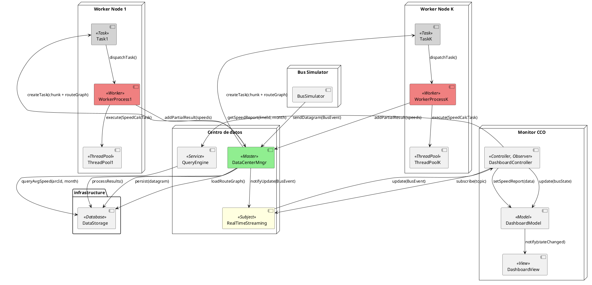

# Plan de Arquitectura: Sistema de Monitoreo y Análisis SITM-MIO

## 1. Diagrama de Componentes (Vista Lógica)

## 2. Responsabilidades de los Subproyectos

### A. Bus Simulator (bus-simulator)
- **Rol**: Productor de eventos.
- **Responsabilidad**: Lee archivos CSV históricos y genera un flujo de datagramas simulando la operación en tiempo real.
- **Interacción**: Actúa como cliente Ice que invoca métodos en el Event Processor.

### B. Event Processor (event-processor)

- **Rol**: Orquestador, Filtro y Productor de Eventos.

- **Responsabilidad**:
  - Recibir datagramas provenientes del Bus Simulator.
  - Validar y normalizar la información recibida.
  - Clasificar eventos según su criticidad.
  - Publicar eventos en tiempo real utilizando el patrón Observer / Pub-Sub.
  - Desacoplar la generación de eventos de los consumidores mediante un esquema Producer-Consumer.

- **Interacción**:
  - Servidor Ice para los buses.
  - Publicador de eventos para el Visualizer y otros consumidores futuros.
  - Cliente de persistencia para el Data Center.

### C. Data Center / Data Warehouse (data-center)

- **Rol**: Almacén Persistente y Motor Analítico.

- **Responsabilidad**:
  - Almacenar todos los datagramas recibidos.
  - Realizar map matching básico para asociar posiciones GPS a los arcos correspondientes del grafo de rutas.
  - Coordinar un conjunto de Workers especializados en el cálculo de velocidad promedio por arco del grafo de rutas.
  - Distribuir bloques de eventos históricos entre los Workers utilizando el patrón Master-Worker.
  - Permitir que cada Worker procese concurrentemente múltiples segmentos de datos mediante un Thread Pool.
  - Consolidar los resultados generados por los Workers y exponerlos mediante servicios de consulta.
  - Coordinar la ejecución de tareas analíticas mediante objetos de trabajo independientes (Task Objects).
  - Proveer un servicio especializado de consultas históricas (Query Engine) para desacoplar el acceso a reportes del almacenamiento físico.

- **Interacción**:
  - Servidor Ice que ofrece servicios de persistencia y consulta de reportes.
  - Actúa como Master dentro del patrón Master-Worker.

### D. Visualizer Client (visualizer-client)

- **Rol**: Consumidor, Presentación y Consulta.

- **Responsabilidad**:
  - Mostrar en tiempo real la ubicación de los buses.
  - Consultar reportes históricos de velocidad promedio.
  - Implementar una arquitectura MVC (Model-View-Controller) para separar la lógica de presentación, los datos y la interacción del usuario.
  - Suscribirse a eventos publicados por el sistema de streaming.

- **Interacción**:
  - Actúa como Observer dentro del patrón Observer / Pub-Sub.
  - Consume servicios de consulta expuestos por el Query Engine.

## 3. Flujo de Datos y Protocolo RPC (Ice)

1. **Ingesta**: El Bus Simulator invoca processDatagram(data) en el Event Processor.

2. **Procesamiento**: El Event Processor transforma las coordenadas y decide:
   - Enviar a Data Center mediante archive(data) (Asíncrono/Unidireccional para rendimiento).
   - Enviar a Visualizer mediante un callback updateLocation(busId, pos) si el visualizador está activo.

3. **Análisis Histórico**:
   - El Data Center carga el grafo de rutas y los eventos históricos almacenados.
   - El componente Master divide los datos en bloques de trabajo.
   - Para cada bloque se crea un Task Object que encapsula los datos y parámetros necesarios para el cálculo.
   - Los Task Objects son distribuidos a múltiples Workers.
   - Cada Worker ejecuta las tareas asignadas utilizando un Thread Pool interno.
   - Cada tarea realiza map matching básico y calcula velocidades utilizando la distancia geográfica entre posiciones GPS consecutivas y la diferencia temporal entre eventos.
   - Los Workers generan resultados parciales por arco.
   - El Master consolida los resultados parciales y genera las velocidades promedio finales.
   - Los resultados son almacenados para consultas posteriores.

4. **Consulta**: El Visualizer solicita getAverageSpeed(arcId, month) al Data Center.

## 4. Patrones de Diseño Sugeridos

- **Observer / Pub-Sub**:
  Utilizado para distribuir eventos en tiempo real hacia los componentes interesados sin acoplar directamente al productor de eventos con los consumidores.

- **MVC (Model-View-Controller)**:
  Implementado en el Visualizer Client para separar la lógica de negocio, la representación visual y la interacción del usuario.

- **Producer-Consumer**:
  Utilizado entre el Bus Simulator, el Event Processor y el Data Center para desacoplar la generación de eventos de su procesamiento.

- **Strategy Pattern**:
  Utilizado para encapsular diferentes estrategias de validación, filtrado y clasificación de eventos.

- **Task Object Pattern**:
  Utilizado para representar cada unidad de procesamiento analítico distribuido. Cada tarea contiene el bloque de datos y la información necesaria para ejecutar cálculos de velocidad sobre una porción específica del conjunto de eventos.

- **Data Transfer Object (DTO)**:
  Definidos en Slice para asegurar que los objetos intercambiados mediante Ice sean ligeros, serializables y fuertemente tipados.

- **Repository Pattern**:
  Utilizado en el Data Center para abstraer el acceso a los eventos históricos, el grafo de rutas y los reportes de velocidad.

- **Query Engine Pattern**:
  Implementado como una capa especializada para consultas históricas y generación de reportes, desacoplando el acceso a la información analítica del almacenamiento físico.

- **Master-Worker Pattern**:
  Utilizado en el Data Center para distribuir el procesamiento de grandes volúmenes de eventos históricos entre múltiples Workers. El Master coordina la división de los datos, asigna tareas y consolida resultados.

- **Thread Pool Pattern**:
  Implementado dentro de cada Worker para ejecutar concurrentemente múltiples tareas reutilizando un conjunto fijo de hilos, reduciendo la sobrecarga asociada a la creación y destrucción de threads.

## 5. Definición de Interfaces (Contratos Previstos)

- **DatagramReceiver**: Interfaz expuesta por el Event Processor.
- **ArchiveService**: Interfaz expuesta por el Data Center.
- **MonitoringSubscriber**: Interfaz de callback para el Visualizer.
- **TaskDispatcher**: Interfaz utilizada por el Master para asignar tareas a los Workers.
- **QueryProvider**: Interfaz expuesta por el Query Engine para consultas históricas.
- **ReportProvider**: Interfaz para consultar velocidades promedio por arco, estadísticas históricas y reportes agregados.