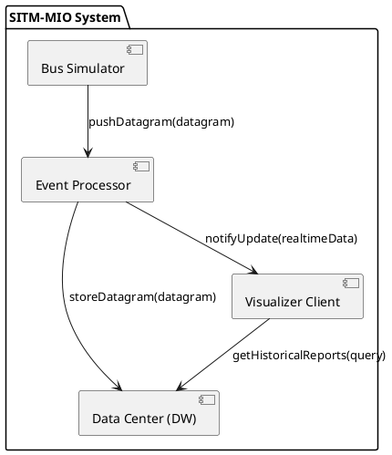

# Plan de Arquitectura: Sistema de Monitoreo y Análisis SITM-MIO

## 1. Diagrama de Componentes (Vista Lógica)

## 2. Responsabilidades de los Subproyectos

### A. Bus Simulator (bus-simulator)
- **Rol**: Productor de eventos.
- **Responsabilidad**: Lee archivos CSV históricos y genera un flujo de datagramas simulando la operación en tiempo real.
- **Interacción**: Actúa como cliente Ice que invoca métodos en el Event Processor.

### B. Event Processor (event-processor)
- **Rol**: Orquestador y Filtro.
- **Responsabilidad**: Recibe datagramas, valida su integridad, normaliza las coordenadas (de entero a decimal) y clasifica el evento según su criticidad. Implementa el patrón Publisher-Subscriber para notificar al Visualizer en tiempo real.
- **Interacción**: Servidor Ice para los buses y cliente para el Data Center y Visualizer.

### C. Data Center / Data Warehouse (data-center)

- **Rol**: Almacén Persistente y Motor Analítico.

- **Responsabilidad**:
  - Almacenar todos los datagramas recibidos.
  - Realizar map matching básico para asociar posiciones GPS a los arcos correspondientes del grafo de rutas.
  - Coordinar un conjunto de Workers especializados en el cálculo de velocidad promedio por arco del grafo de rutas.
  - Distribuir bloques de eventos históricos entre los Workers utilizando el patrón Master-Worker.
  - Permitir que cada Worker procese concurrentemente múltiples segmentos de datos mediante un Thread Pool.
  - Consolidar los resultados generados por los Workers y exponerlos mediante servicios de consulta.

- **Interacción**:
  - Servidor Ice que ofrece servicios de persistencia y consulta de reportes.
  - Actúa como Master dentro del patrón Master-Worker.

### D. Visualizer Client (visualizer-client)
- **Rol**: Consumidor y Presentación.
- **Responsabilidad**: Interfaz gráfica que muestra el mapa de Cali con los buses en movimiento y permite consultar los reportes de velocidad generados por el Data Center.
- **Interacción**: Suscriptor de eventos en tiempo real y cliente de consultas históricas.

## 3. Flujo de Datos y Protocolo RPC (Ice)

1. **Ingesta**: El Bus Simulator invoca processDatagram(data) en el Event Processor.

2. **Procesamiento**: El Event Processor transforma las coordenadas y decide:
   - Enviar a Data Center mediante archive(data) (Asíncrono/Unidireccional para rendimiento).
   - Enviar a Visualizer mediante un callback updateLocation(busId, pos) si el visualizador está activo.

3. **Análisis**:
   - El Data Center (Master) divide los eventos históricos en bloques de trabajo.
   - Los bloques son distribuidos a múltiples Workers.
   - Cada Worker utiliza un Thread Pool para procesar concurrentemente los segmentos asignados.
   - La velocidad se calcula utilizando la distancia geográfica entre posiciones GPS consecutivas y la diferencia temporal entre eventos.
   - Los resultados parciales son enviados al Master para su consolidación.
   - El Master genera la velocidad promedio final para cada arco del grafo.

4. **Consulta**: El Visualizer solicita getAverageSpeed(arcId, month) al Data Center.

## 4. Patrones de Diseño Sugeridos

- **Observer / Pub-Sub**: Para la actualización de posiciones en tiempo real sin que el Event Processor dependa fuertemente del Visualizer.
- **Strategy Pattern**: Para el filtrado de eventos.
- **Data Transfer Object (DTO)**: Definidos en Slice para asegurar que los objetos que viajan por la red sean ligeros y tipados.
- **Repository Pattern**: En el Data Center para abstraer el almacenamiento físico de la lógica de negocio de los reportes.
- **Master-Worker Pattern**: En el Data Center para distribuir el procesamiento de grandes volúmenes de eventos históricos entre múltiples nodos Worker. Un componente Master coordina la división de los datos, asigna tareas de cálculo de velocidad promedio a los Workers y consolida los resultados parciales. Este patrón mejora la escalabilidad horizontal y reduce el tiempo requerido para procesar los millones de eventos generados por la operación del SITM-MIO.
- **Thread Pool Pattern**: Implementado dentro de cada Worker para gestionar eficientemente múltiples tareas concurrentes de procesamiento sin crear y destruir hilos continuamente. Los Workers reutilizan un conjunto fijo de hilos para ejecutar cálculos de velocidad sobre diferentes segmentos de datos, mejorando el rendimiento y reduciendo el consumo de recursos del sistema.

## 5. Definición de Interfaces (Contratos Previstos)

- **DatagramReceiver**: Interfaz expuesta por el Event Processor.
- **ArchiveService**: Interfaz expuesta por el Data Center.
- **MonitoringSubscriber**: Interfaz de callback para el Visualizer.
- **ReportProvider**: Interfaz para consultar velocidades promedio por arco, estadísticas históricas y reportes agregados.
